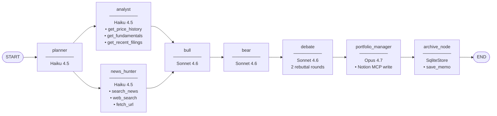

# TB's Personal Stock Guru

A multi-agent investment research desk that runs a full buy-side workflow on any stock ticker in roughly two minutes. You type a ticker; a coordinated team of LLM agents gathers market data and SEC filings, hunts for recent news, stages a structured bull-vs-bear debate, and produces a signed investment memo with a recommendation, conviction score, and full narrative — all saved automatically to Notion and traced in LangSmith.

---

## Architecture



`analyst` and `news_hunter` run in parallel (LangGraph fan-out). `bull` waits for both (implicit fan-in). Every other step is sequential.

---

## Capabilities

### Multi-agent orchestration
Eight specialised agents, each with a distinct role and prompt, coordinated by a [LangGraph](https://github.com/langchain-ai/langgraph) `StateGraph`. Parallel execution of the data-gathering phase (analyst + news hunter) cuts wall-clock time. See [`agents/`](agents/) for each node and [`agents/graph.py`](agents/graph.py) for the graph definition.

### Tool use
The analyst runs a ReAct loop over three tools: live price history and fundamental ratios via Finnhub (`tools/market_data.py`), and SEC EDGAR filings (`tools/filings.py`). The news hunter runs a parallel ReAct loop over NewsAPI, Tavily web search, and URL fetching (`tools/news.py`, `tools/web.py`). Every tool call is defensive — errors return a valid object with an `error` field rather than crashing the pipeline.

### Long-term memory
Between runs, user profile data (risk tolerance, holdings, sectors of interest) and prior investment memos are persisted in a local `SqliteStore` via [LangGraph's memory API](https://langchain-ai.github.io/langgraph/concepts/memory/). On the next run for the same ticker, the analyst and news hunter receive a one-paragraph context injection summarising your prior view and any profile constraints. See [`memory/store.py`](memory/store.py).

### MCP (Notion)
After each run, the portfolio manager saves the final memo to a Notion database using the [Model Context Protocol](https://modelcontextprotocol.io/) via the official `@notionhq/notion-mcp-server` package over stdio. The save is a resilient side-effect — a Notion failure never aborts the pipeline. See [`tools/mcp_loader.py`](tools/mcp_loader.py).

### Observability (LangSmith)
Every run is traced end-to-end in [LangSmith](https://smith.langchain.com) under the `stock-guru` project. The `archive_node` and `save_memo` functions are explicitly wrapped with `@traceable` so the Notion write appears as a named child span. Token counts, latencies, and the full prompt/response chain for every node are visible in the trace. See the `LANGSMITH_*` env vars in [Setup](#setup) below.

---

## Setup

### Prerequisites

| Tool | Version | Notes |
|------|---------|-------|
| Python | 3.12+ | `python --version` |
| [uv](https://github.com/astral-sh/uv) | any recent | `pip install uv` or `curl -LsSf https://astral.sh/uv/install.sh \| sh` |
| Node.js + npx | 20+ | Required for Notion MCP stdio server. `node --version` and `npx --version` must both succeed. |

Install dependencies:

```bash
uv sync
```

### Environment variables

Copy the example file and fill in your keys:

```bash
cp .env.example .env
```

| Variable | Purpose | Where to get it |
|----------|---------|----------------|
| `ANTHROPIC_API_KEY` | Claude models (Haiku, Sonnet, Opus) | https://console.anthropic.com |
| `TAVILY_API_KEY` | Web search tool | https://tavily.com |
| `FINNHUB_API_KEY` | Market data (price history, fundamentals) | https://finnhub.io |
| `NEWSAPI_KEY` | News headlines | https://newsapi.org |
| `NOTION_API_KEY` | Notion integration token (starts with `ntn_` or `secret_`) | https://www.notion.so/profile/integrations |
| `NOTION_DATABASE_ID` | 32-character ID from your Notion database URL | See Notion setup below |
| `LANGSMITH_API_KEY` | LangSmith tracing | https://smith.langchain.com |
| `LANGSMITH_TRACING` | Enable tracing (`true` / `false`) | Set to `true` |
| `LANGSMITH_PROJECT` | Project name in LangSmith UI | Set to `stock-guru` |
| `LANGSMITH_ENDPOINT` | LangSmith API endpoint | `https://api.smith.langchain.com` (US) or `https://eu.api.smith.langchain.com` (EU) |

### Notion database setup

1. Create a Notion internal integration at https://www.notion.so/profile/integrations and copy the token into `NOTION_API_KEY`.
2. Create (or identify) the target database and copy its 32-character ID from the URL into `NOTION_DATABASE_ID`.
3. Open the database → `…` menu → *Connections* → add your integration. Without this step all Notion saves are silently skipped.

The database must have these properties (names and types must match exactly):

| Property name | Notion type |
|---------------|-------------|
| Ticker | Title |
| Recommendation | Multi-select |
| Conviction | Number |
| Time Horizon | Multi-select |
| Date | Date |
| Thesis | Text (rich text) |

### Run the CLI

```bash
uv run python agents/graph.py NVDA
```

### Run the Streamlit dashboard

```bash
uv run streamlit run ui/app.py
```

Opens at http://localhost:8501. Four tabs: Research (run + stream live results), Portfolio (sparkline cards for your holdings), Archive (searchable memo history), Settings (user profile).

### Run with Docker

Alternatively, run the full stack (Streamlit + Caddy reverse proxy with basic auth) in containers:

```bash
cp .env.example .env
# edit .env with your keys
docker compose up -d
```

Opens at http://localhost:8501. You'll be prompted for HTTP basic-auth credentials before reaching the dashboard. To set your own credentials, edit `Caddyfile` and replace the bcrypt hash:

```bash
docker run --rm caddy:2-alpine caddy hash-password --plaintext "your-password"
```

Then restart Caddy: `docker compose restart caddy`.

Data persists in `./data/` (SQLite databases) across container restarts.

---

## Project structure

```
.
├── agents/             # LangGraph node functions + graph builder
│   ├── graph.py        #   StateGraph definition, build_graph(), __main__ CLI runner
│   ├── analyst.py      #   Fundamental + technical analysis (ReAct, Haiku)
│   ├── news_hunter.py  #   News & sentiment gathering (ReAct, Haiku)
│   ├── bull.py         #   Bull case author (Sonnet)
│   ├── bear.py         #   Bear case author (Sonnet)
│   ├── debate.py       #   Rebuttal rounds (Sonnet)
│   └── portfolio_manager.py  # Final memo synthesis + Notion save (Opus)
├── evals/              # Evaluation harness
│   ├── run_evals.py    #   5-ticker scorecard with Haiku judge calls
│   └── results/        #   Generated markdown reports (git-ignored)
├── memory/             # Long-term memory layer
│   ├── store.py        #   SqliteStore helpers: save_memo, get_memo_history, user profile
│   └── __init__.py
├── scripts/            # One-off utility scripts
│   └── test_notion_mcp.py  # Verify Notion MCP connection + list tools
├── state/              # Shared Pydantic / TypedDict state schema
│   └── research_state.py   # ResearchState, InvestmentMemo, AnalystFindings, …
├── tests/              # Pytest test suite (tools, memory)
├── tools/              # Tool implementations
│   ├── market_data.py  #   Finnhub price history + fundamentals
│   ├── filings.py      #   SEC EDGAR recent filings
│   ├── news.py         #   NewsAPI search
│   ├── web.py          #   Tavily web search + URL fetch
│   └── mcp_loader.py   #   Notion MCP client (langchain-mcp-adapters)
├── ui/                 # Streamlit dashboard
│   ├── app.py          #   Entry point: tabs, session state, graph cache
│   ├── components.py   #   Pure render functions (no session state reads/writes)
│   └── streaming.py    #   graph.stream() driver with @traceable wrapper
├── data/               # Local SQLite databases (git-ignored)
│   ├── checkpoints.db  #   LangGraph checkpoint store
│   └── memory.db       #   Long-term memo + user profile store
└── .env                # API keys (git-ignored — copy from .env.example)
```

---

## License

MIT
